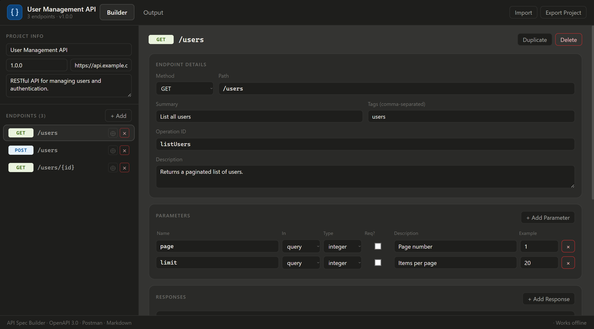
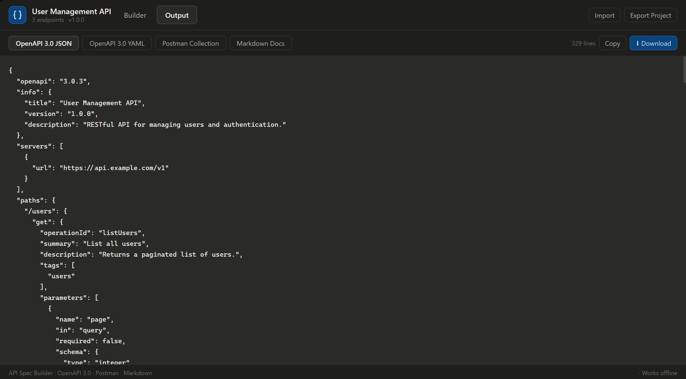

# API Spec Builder


## Overview

Writing OpenAPI specifications or Postman collections by hand is often tedious, error-prone, and time-consuming. **API Spec Builder** solves this by providing an intuitive, GUI-driven approach to API design.

Built entirely on the client-side, this tool allows developers, system analysts, and technical writers to visually construct API endpoints, define complex request/response payloads, and instantly export them into multiple formats—all without writing a single line of YAML or JSON.

---

## Key Features

- **Visual API Modeling:** Effortlessly define HTTP methods, paths, parameters (query, path, header), and status codes through a clean UI.
- **Deep Nesting Support:** Fully supports complex data structures, including `array<object>` and deeply nested JSON schemas.
- **Real-time Generation:** Instantly compiles your visual design into:
    - `OpenAPI 3.0.3` (JSON & YAML)
    - `Postman Collection v2.1` (Ready to import & test)
    - `Markdown` (Perfect for GitHub Wikis or Notion)
- **Local-First & Privacy-Focused:** 100% client-side execution. No backend, no databases, and no tracking. Your API designs never leave your browser.
- **State Persistence:** Export your entire workspace as a `.json` project file and import it later to resume your work.
- **Adaptive UI:** Fully responsive with native Dark/Light mode support based on system preferences.

---

## Architecture & Engineering

This project was architected with **Scalability**, **Maintainability**, and **Type Safety** in mind. It serves as a showcase of modern React development patterns:

- **Strict Type Safety:** Developed with 100% TypeScript strict mode. All API schemas, HTTP methods, and internal states are strongly typed using interfaces and literal unions.
- **Separation of Concerns (SoC):**
    - **UI Components:** Dumb, presentational components built with Tailwind CSS.
    - **Business Logic:** Extracted into custom React Hooks (`useEndpoints`, `useProjectIO`).
    - **Core Engine:** Pure TypeScript functions (`openApiBuilder.ts`, `yamlSerializer.ts`) handle the heavy lifting of AST-to-String compilation without relying on React state.
- **Zero Heavy Dependencies:** Instead of relying on massive libraries like `js-yaml` or complex state managers, this project utilizes native React hooks and custom lightweight serializers to keep the bundle size incredibly small.

---

## Getting Started

Follow these steps to run the project locally.

### Prerequisites
- Node.js (v18 or higher)
- npm, yarn, or pnpm

### Installation

1. **Clone the repository**
   ```bash
   git clone https://github.com/jauharfz/api-spec-builder.git
   cd api-spec-builder
   ```

2. **Install dependencies**
   ```bash
   npm install
   ```

3. **Run the development server**
   ```bash
   npm run dev
   ```
   The app will be available at `http://localhost:5173`.

### Building for Production

To create an optimized production build:
```bash
npm run build
npm run preview
```

---

## Screenshots

### Builder Interface
Visual editor for defining endpoints, parameters, and nested request bodies.


### Generated Output
Instantly compiled OpenAPI specs, Postman collections, and Markdown documentation.



---

## Contributing

Contributions, issues, and feature requests are welcome! Feel free to check the [issues page](https://github.com/jauharfz/api-spec-builder/issues).

1. Fork the Project
2. Create your Feature Branch (`git checkout -b feature/AmazingFeature`)
3. Commit your Changes (`git commit -m 'Add some AmazingFeature'`)
4. Push to the Branch (`git push origin feature/AmazingFeature`)
5. Open a Pull Request

---

## License

Distributed under the MIT License. See `LICENSE` for more information.

---
*Designed and engineered by [Anthropic](https://www.anthropic.com) and Me.*